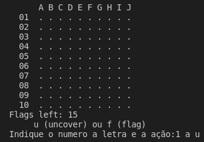
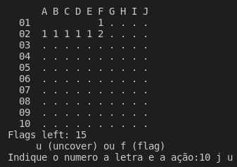
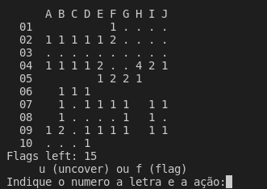

# This project was develop to the subject programming 1 
### Where we learn c-language of programing
This was the final project which consisted of developing a minesweeper in c.  
 
 
  

---

🗂 [[parent directory]](..)  
  
📂 [P1-mineweeper]()   
&emsp;&emsp;📂 [ft]()  
&emsp;&emsp;&emsp;&emsp;📄 [1.png](ft/1.png)  
&emsp;&emsp;&emsp;&emsp;📄 [2.png](ft/2.png)  
&emsp;&emsp;&emsp;&emsp;📄 [3.png](ft/3.png)  
&emsp;&emsp;📄 [48092_48402.pdf](48092_48402.pdf)  
&emsp;&emsp;📄 [board442](board442)  
&emsp;&emsp;📄 [enunciado v1.1.pdf](enunciado%20v1.1.pdf)  
&emsp;&emsp;📄 [mine_functions.c](mine_functions.c)  
&emsp;&emsp;📄 [mine_functions.h](mine_functions.h)  
&emsp;&emsp;📄 [minesweeper.c](minesweeper.c)  
&emsp;&emsp;📄 [LICENSE](LICENSE)     
 